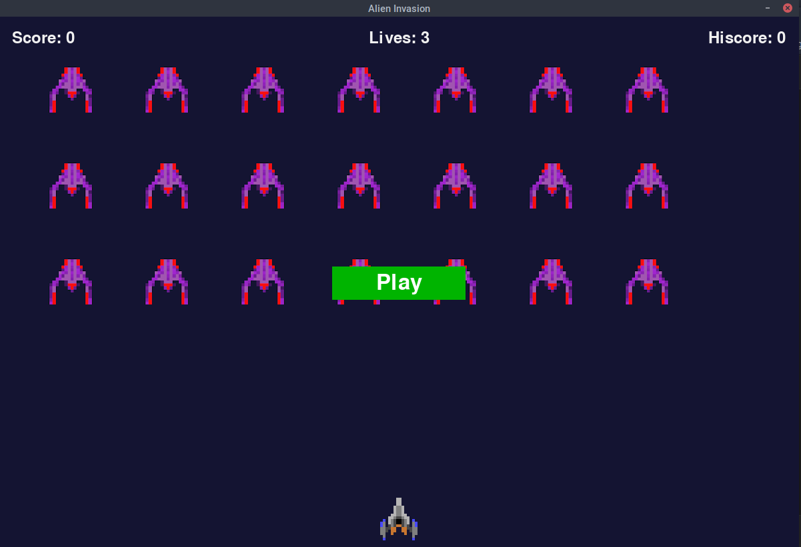

# Alien Invasion

# Install

```git clone https://github.com/digitalight/python_alien_invasion.git```

```cd python_alien_invasion```

Make sure pipenv is installed on your system ```sudo apt install pipenv```

Then install the required modules for the project with

```pipenv install -r requirements.txt```

Enable the environment with

```pipenv shell```

# Playing the game

Run ```python3 alien_invasion.py```

### Controls

Press P or click Play to begin.
<- -> Arrows keys to move ship
Spacebar to fire.



First project in the second half of the book. Using PyGame

# Plan

- [x]   Player controls a rocket ship that appears at the bottom center of the screen.
- [x]   The Player can move the ship right and left using the arrow keys.
- [x]   The Player can shoot bullets using the spacebar.
- [x]   When game starts a fleet of aliens fills the sky and moves across and down the screen.
- [x]   The player shoots and destroys the aliens.
- [x]   If the player shoots all the aliens, a new fleet appears that moves faster.
- [x]   If any aliens hit the player or reach the bottom of the screen. Player loses a ship.
- [x]   If player loses ship 3 times, the game ends.
- [x]   Add scoreboard

Extra addons:

- [x]   Add Highscore to scoreboard
- [ ]   Add SFX
- [ ]   Make better title screen
- [ ]   Instructions on how to play the game
